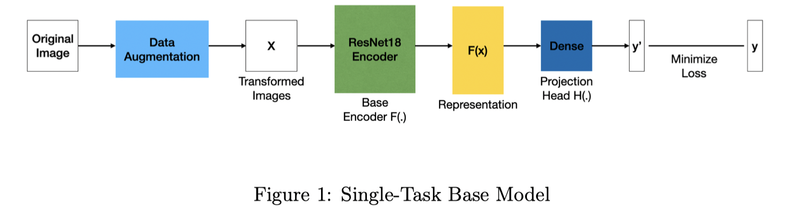
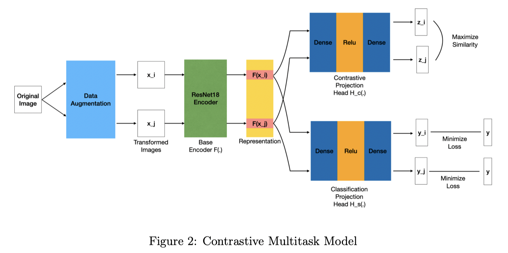
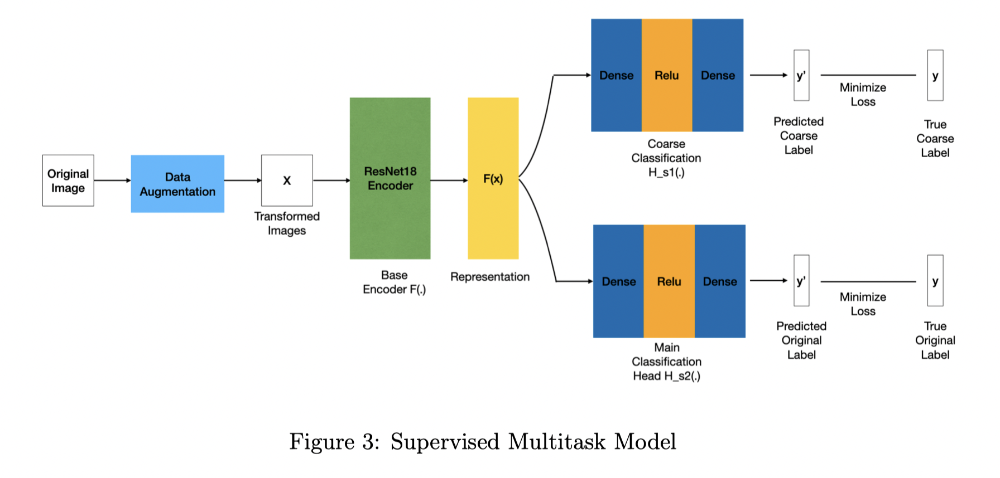
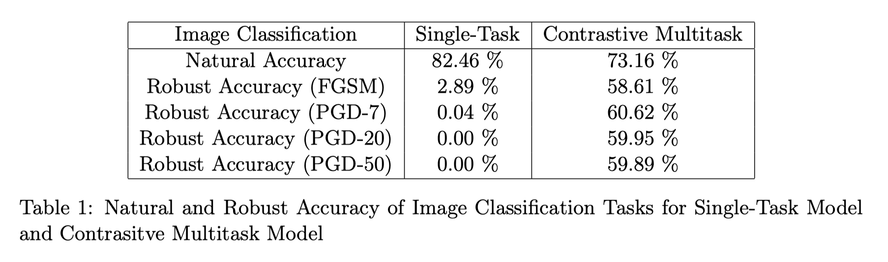
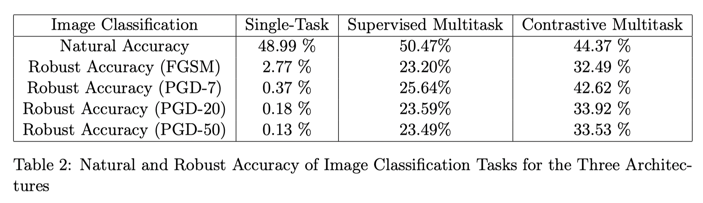

# Robust Machine Learning Final Project - Multitask Learning with Self-Supervision to Improve Robustness

This source code is built from the Pytorch SimCLR implementation from sthalles/SimCLR.

## Project Abstract

While deep neural networks achieves good accuracy in many applications, they remain vulnerable under adversarial attacks. In our project, we investigate the architecture of multitask learning, specifically multitask learning combined with self-supervised learning, and its affect on model robustness. We use Contrastive Learning as the self-supervised task that is trained in parallel with the main supervised task. Our experiment shows that training with auxiliary Contrastive Learning task yields a robust accuracy of 60% in the main classification task. Moreover, we compare the effects of a Supervised auxiliary task and a Contrasitve auxiliary task, and the result shows that Contrastive auxiliary task provides much larger robustness improvement than the Supervised auxiliary task. These two experiments together show that Contrastive Learning provides a strong regularization when trained together with a Classification task, forcing the model to learn a more robust image representation.

## Architecture
### Model 1: Single-Task Base Model
This is just a vanilla ResNet18 model for a single Image Classification task.

### Model 2: Contrastive Multitask Model
In this model, we have two prediction heads on top of the base model (ResNet18), one Image Classification task and the other one Contrastive Learning task. We optimize for the two tasks simultaneously in training.

### Model 3: Supervised Multitask Model
In this model, we have two prediction heads on top of the base model (ResNet18). The two heads are both Image Classification tasks, one predicting the "fine-grained" labels of [CIFAR100](https://www.cs.toronto.edu/~kriz/cifar.html), and the other one predicting the "coarse" labels of the same dataset. 

We compare the robustness of the main Image Classification Task across the three models, and see if Contrastive Multitask Learning gives exceptional boost in the main task's robustness. Again, the two tasks are optimized in parallel.

## Experiment result
We have conducted two experiments: (1) with CIFAR10, comparing Model 1 and Model 2; (2) with CIFAR100, comparing Model 1, 2, and 3. The experiment results are as follows:

We can see that in CIFAR10, the contrastive learning auxilliary task brings a marginal increase in main task robustness of around 60%. In CIFAR100, the marginal increase brought from Supervised Multitask (Model 3) is around 25%, while contrastive learning brings an increase of around 42%. The result shows that contrastive learning, while training with Image Classification together, serves as a "regularization" that forces the base model to learn a more robust representations of the images, which results in more robust Image Classification results.

## Code Breakdown, running the demo